# Researchdesk

**Agentic investment research with executable experiments and inspectable decisions.**

Researchdesk gives specialist LLM agents a bounded environment to investigate
hypotheses, delegate research and coding, run Python experiments, and challenge
each other's conclusions. The workbench preserves the evidence, tool calls,
input versions, failures, and reviews behind each result.

Research spans quantitative strategies and clinical evidence; it is not
restricted to SEC filings. Trading is entirely paper, with no live broker client.

## Follow the work, not just the answer

```mermaid
flowchart LR
    Brief[Research question] --> Coordinator
    Coordinator --> Researcher[Source research]
    Coordinator --> Coder[Code and experiments]
    Researcher --> Library[Versioned research library]
    Library --> Coder
    Coder --> Sandbox[Isolated Python]
    Sandbox --> Experiment[Computed experiment]
    Experiment --> Reviewer[Independent task review]
    Reviewer -->|revise| Coordinator
    Reviewer -->|accept exact version| Decision[Paper proposal]
    Decision --> Risk[Deterministic risk admission]
    Risk --> Ledger[Replayable paper ledger]
```



- **Actual tool calling.** OpenAI Responses and a tools-disabled Claude CLI
  adapter drive a typed registry. Roles, schemas, shared budgets, cancellation,
  and idempotency are enforced in application code.
- **Durable orchestration.** Coordinators yield while specialists run, then
  resume with retained outcomes. Database leases fence replaced workers;
  committed effects survive retries. PostgreSQL transactions serialize competing
  case changes and paper-account reservations.
- **Executable research.** Python runs in a nonroot Docker container with no
  network or host mounts, bounded resources, output limits, and cancellation.
  Strategy decisions receive only observed history and fill at the next session
  open. Coders can define reusable analysis tools; independent test cases must
  pass before other agents can invoke that exact version.
- **Specialists created from research needs.** Agents propose domain mandates,
  evidence standards, instructions and tools in response to retained observations.
  Independent review precedes activation. Delegated specialists receive a versioned
  profile, with its tool permissions enforced by the server.
- **Version-specific review.** Experiments bind data and code hashes. Reviewers
  must identify the exact output inspected. Synthetic data, unrelated reviews,
  or an author's own review cannot authorize a paper order.
- **Source-backed memory.** Market data, ClinicalTrials.gov, PubMed, and
  allowlisted HTTPS sources retain provenance. BM25 or local dense retrieval
  returns attributable passages; immutable content keys the embedding cache.
- **Research accountability.** Falsifiable hypotheses retain revisions and
  rejections. Clinical dossiers preserve source-specific populations, analyses
  and disagreements, with exact citations and explicit missingness. Bounded source
  navigation keeps raw values and local group identities intact. Legacy extraction
  comparisons use labels hidden from agents; the new source-qualified output
  contract still needs independently checked references before clinical scoring.
- **An inspectable product.** React/Next.js views expose investigations, delegated
  work, tool inputs/results, code, equity curves, comparisons, review findings,
  library search, and paper accounting. Failures and missing valuations remain visible.

## Run locally

Use Python 3.12+, Node 24, and Docker for generated-code execution. SQLite is the
local default; PostgreSQL supports a shared worker deployment.

```sh
python3.12 -m venv .venv
source .venv/bin/activate
python -m pip install -c requirements.lock -e '.[dev,retrieval]'
docker build -f deploy/sandbox.Dockerfile -t researchdesk-sandbox:local .
researchdesk doctor
researchdesk serve
```

In another terminal:

```sh
cd web
npm ci
npm run build
npm start
```

Open **http://127.0.0.1:3000**. The API listens on **127.0.0.1:8010**.
An unconfigured provider blocks agent launches; there is no canned research fallback.

Configure credentials locally in the ignored `.env` file, then run
`researchdesk worker` in an activated Python environment:

| Variable | Purpose |
| --- | --- |
| `RESEARCHDESK_PROVIDER` | `openai` or `claude_cli` |
| `RESEARCHDESK_MODEL` | A model available to the selected provider |
| `RESEARCHDESK_OPENAI_API_KEY` | Required for OpenAI; keep local |
| `RESEARCHDESK_CLAUDE_BINARY` | Optional Claude executable path; authenticate with `claude auth login` |
| `RESEARCHDESK_RETRIEVAL_MODE` | `lexical` (default) or `dense` |
| `RESEARCHDESK_TRADIER_SANDBOX_TOKEN` | Optional delayed options research data; sandbox token, kept on the worker or local CLI |

Provider usage is billed by the configured service. Model turns and shared tool
calls are bounded. Worker heartbeats report provider and sandbox readiness.

## Inspect options research data

Agents can discover expirations and acquire one underlying/expiry chain through
Tradier's free sandbox API. Each acquisition retains quote timestamps, receipt
time, source provenance and validation issues in an immutable artifact linked
to its investigation. The inspector supports calls/puts, contract lookup and
data-issue filters. These delayed snapshots cannot authorize execution.

The same acquisition path is available without a model key:

```sh
researchdesk options-expirations --case-id CASE_ID --underlying SYMBOL \
  --purpose "Find expirations covering the hypothesis horizon."
researchdesk options-chain --case-id CASE_ID --underlying SYMBOL \
  --expiration YYYY-MM-DD --purpose "Inspect the quoted cost of this research thesis."
```

Configure the sandbox token in the ignored `.env` first. Commands require an
existing case and write access. A new command captures a new observation; it does
not replace old evidence. See [options data and verification](docs/research/options-data.md)
for timing, contract/size limitations, setup and the explicitly synthetic UI fixture.

## Inspect a real computation without a model key

```sh
python examples/verify_tools.py \
  --symbol TSLA --start 2025-01-01 --end 2025-05-01 --generated
```

This acquires market history and runs the actual tool pipeline, retaining data,
code, calls, and computed results in an explicitly labelled verification case.
It does not manufacture an agent run, review verdict, or paper decision. The
volatility-scaled trend example is executable code, not a performance claim.
Fresh containers for each decision make generated evaluation take several minutes.

## Evaluation boundaries

The engine computes long-only equity/ETF daily-bar simulations with cash and
buy-and-hold comparators, fees, slippage, drawdowns, and retained fills.
Chronological walk-forward selection operates on a declared SMA parameter family
and reports geometrically linked, reset-fold results, not a continuously funded account.

Prefix isolation prevents running code from reading future rows. It does not
make code authored after observing historical outcomes unbiased. Generated
historical experiments are diagnostics; stronger claims require independent
code review and genuinely withheld evaluation.

Dividend/split intervals are rejected rather than silently mis-accounted.
Options tools retain delayed chain observations and compute explicit expiration
scenarios, without options execution or lifecycle accounting. Clinical comparisons
compute uncertainty intervals from supplied counts; reviewers must check the
counts against sources. Neither clinical
efficacy nor investment alpha follows merely from a successful tool call.

Paper orders require an accepted version-specific experiment, fresh attributable
quotes, available cash or shares, and exposure limits. Decimal accounting retains
reservations and partial fills in a replayable ledger. Missing marks produce an
unavailable valuation, never a zero price. A separate paper worker reads Alpaca
quotes and the official session calendar, then consumes reviewed intents within
an explicitly activated, versioned mandate. Halt/exit-only controls cancel pending
orders without liquidating holdings. Closing-window P&L retains missing baselines
as gaps. This is a local quote-driven equity simulation, not broker execution;
authenticated feed validation remains a separate integration gate.

The Operations page deliberately starts without risk defaults or an active mandate.
See [paper operations](docs/paper-operations.md) for semantics and current limits.

## Verification

```sh
ruff check src tests examples
pytest -q -m 'not sandbox and not live and not integration'
RESEARCHDESK_SANDBOX_IMAGE=researchdesk-sandbox:local pytest -q -m sandbox
cd web
npm run typecheck
npm test
npm run build
```

PostgreSQL tests require an explicitly configured disposable database and isolate
each test in its own schema. Live provider tests are opt-in. See
[operations](docs/operations.md) for exact commands.

Tests cover causality, hand-computed accounting, competing workers and orders,
lease takeover, cancellation, duplicate effects, review binding, source-fetch
boundaries, container isolation, and API authorization. Synthetic fixtures are
labelled and cannot authorize orders. Python versions are recorded in
`requirements.lock`; frontend versions are locked in `web/package-lock.json`.

## Design and deployment

- [Staged engineering roadmap and acceptance gates](docs/engineering-roadmap.md)
- [Options engine comparison decision](docs/decisions/0002-options-engine-comparison.md)
- [Executed options-engine feasibility spike](docs/decisions/options-engine-spike.md)
- [Paper operations](docs/paper-operations.md)
- [Architecture](docs/architecture.md)
- [Operations](docs/operations.md)
- [Security boundaries](docs/security.md)
- [Implementation contracts](docs/implementation-contract.md)
- [Research quality and specialist development](docs/research-quality.md)
- [M1 research evaluation protocol](docs/research-evaluation-protocol.md)
- [Frozen development pilot runner](docs/benchmark-runner.md)
- [Evaluation framework comparison and adoption gate](docs/decisions/0004-benchmark-harness.md)
- [Real clinical development corpus and limits](docs/research-benchmark-data.md)
- [Local verification record](docs/verification.md)

Credentials, local research, acquired market datasets, caches, and account state
are excluded from this repository. A public viewer should use a deliberately
curated database in read-only mode, with no worker or Docker socket.

MIT licensed. Built by Ashwin Daswani.
