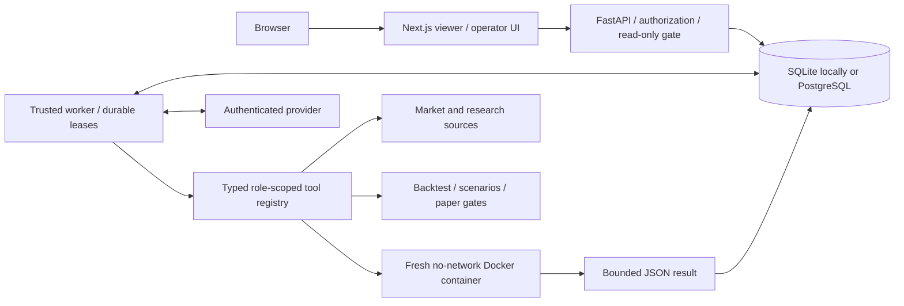

# Architecture and implemented boundaries

The [generated agent, prompt and tool map](generated/agent-architecture.md) includes
every registered tool, per-role diagrams, the shared prompt, dynamic specialist
and task prompt assembly, and the experiment-assessment path. Regenerate it with
`python -m researchdesk.architecture`; the test suite checks for drift.

Research Desk stores work as cases, bounded tasks, immutable artifacts, tool calls
and ordered events. A coordinator can delegate research, coding and review tasks.
The role roster is small; broad coverage comes from assignments, evidence tools
and retained research rather than a claim of a complete autonomous trading firm.

The public viewer contains no worker and has no Docker socket. In operator mode,
the backend enforces authorization and read-only policy for every mutation. The
browser calls a same-origin proxy; secrets remain server-side. The API and worker
communicate through durable database records, not an in-memory agent queue.

## Execution and recovery

The worker claims queued tasks or expired running leases. A heartbeat renews
ownership during model/tool work. Database operations use short transactions;
external I/O occurs outside them. State-changing operations check the current
worker lease. Tool insertion atomically consumes the case's shared tool budget.
Repeated task/call identifiers return the retained record without another debit.

The model's requested calls are persisted before execution. The registry validates
the JSON input schema and the task's stored role before calling a handler. Tool
results are persisted before they are returned to the provider. Mutation handlers
use deterministic idempotency keys so recovery can replay committed work safely.
This does not promise exactly-once execution of arbitrary external reads.

Delegation persists child tasks, then yields the parent. Once children terminalize,
an atomic transition appends their outcomes and requeues the parent. The parent
continues from its stored transcript. Cancellation revokes task ownership and
closes active tool records; replacement workers cannot accept a stale worker's
result. Cooperative shutdown queues interrupted work for resumption.

OpenAI uses the native
[Responses function-call/result protocol](https://developers.openai.com/api/docs/guides/function-calling),
including retained reasoning/output items. The optional Claude CLI adapter uses
validated structured tool requests with all of the CLI's host tools disabled.
There is no model simulator in application code. Scripted providers appear only
in explicitly labelled tests. Live model-driven completion remains unverified
until a provider is configured and a real case is run.

## Evidence, memory and review

Artifacts retain a content hash, producer, kind, and source/input references.
The database verifies content integrity when artifacts are read. Source fetching
retains attribution and treats retrieved text as untrusted data. Clinical evidence,
market snapshots, quantitative analysis and general notes use the same artifact
and task model; SEC filings are one possible source.

Library retrieval searches retained artifacts using explicit lexical or dense
mode. Dense search uses a local embedding model and a rebuildable cache. Similarity
is a retrieval score, not confidence in a financial claim. This is persistent
research memory; it does not retrain an agent or prove it learns better strategies.

Reviews refer to the exact artifact ID and hash, identify their reviewer task, and
may cite only experiments bound to the inspected version. A producer cannot accept
its own artifact. Revision creates another immutable artifact and requires review
of that version. Agent prose and arbitrary Python output cannot become a validated
experiment or a paper-order authorization.

## Quantitative and paper workflows

Backtests evaluate one instrument at a time using chronological daily bars,
next-session-open fills, explicit fees and slippage, cash/share accounting and
recorded assumptions. Unsupported dividend/split intervals are rejected. The
walk-forward implementation selects within the declared SMA family; its output is
not evidence of investable alpha. Options scenarios evaluate explicit expiration
payoffs and do not provide options execution or a calibrated pricing model.

Generated strategies define `run(payload)` and return a target weight. Each
decision runs in a fresh container with only the observed history prefix, current
account state and parameters. The container never receives the complete future
snapshot. This boundary does not prevent a poorly designed strategy from embedding
future information in its source; independent code review and held-out evaluation
remain necessary. General Python analysis is retained as analysis, not silently
promoted to a validated backtest.

Paper intents require an independently accepted, eligible experiment for the
specified instrument. A separate deterministic ledger validates cash, share
availability, exposure, limit price, quote freshness and fill size. Reservations,
fills and cancellations are replayable events. Quotes are supplied explicitly;
there is no live broker connection or promise of realistic exchange execution.
Synthetic fixtures cannot authorize paper orders.

The current system is a tested engineering workbench. It has no multi-tenant
isolation, institutional risk certification, automatic alpha validation, or
investment-performance claim. Further deployment work must preserve these
boundaries rather than turning missing capabilities into labels in the UI.
