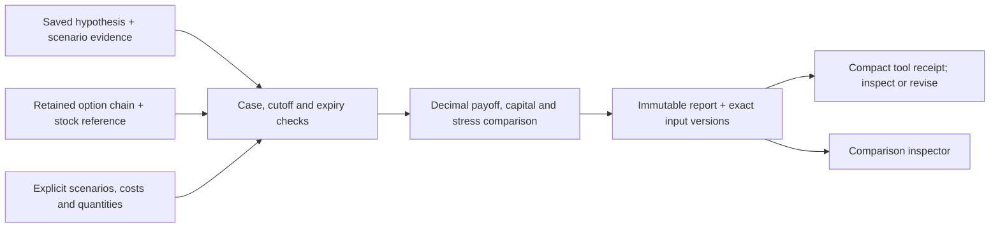

# Hypothesis-linked instrument comparisons

Implemented 2026-10-05 under [ADR 0006](../decisions/0006-instrument-comparison.md).
This component connects a recorded thesis and observed premiums to conditional
instrument tradeoffs. It does not select trades or establish forecast quality.

## Path through the application



`compare_instruments` is registered for the four base research roles. Specialist
profiles continue to restrict their reviewed allowlists. The tool resolves a
same-case hypothesis, one saved options chain and the investigator's scenario
sources. It preserves exact input hashes and checks retention/acquisition against
an explicit information cutoff normalized to UTC.

The investigator supplies one expiry grid, optional probabilities, a capital
amount, fees, a cash return over the horizon, an adverse entry-price change, and
an explicit hypothetical 100-share/USD contract mode. Selected symbols resolve
to the chain's identities and bid/ask observations; there is no option premium
override. Invalid/unavailable alternatives remain rows with reasons.

Every comparison includes cash and stock. Stock can use a saved prior-session
dataset close with an explicit share-basis assumption, or an entirely assumed
price. The original dataset basis, selected JSON path, action records, session and
receipt remain visible. Split-adjusted history is not relabeled as raw or
synchronized with the chain. Missing stock references remain unavailable.

Each alternative independently uses the same hypothetical capital. Explicit whole
quantities are supported; otherwise the maximum affordable quantity is calculated
including entry fees. Residual cash earns the supplied cash return. Cost stress
keeps the base quantity, exposes shortfalls, and neither borrows nor resizes.
The inspector shows both cases, assumed-weight outcomes, loss bounds, source
times, rejected alternatives and input versions without selecting a winner.

The result is a new `instrument_comparison` artifact. Repeated tool delivery
recovers the committed artifact; explicit revisions produce new records.
Cancellation and read-only checks apply. The artifact cannot be used as an equity
dataset, executable experiment or order authorization.

## Reproducible example

```sh
python examples/instrument_comparison_verification.py \
  --database-url sqlite:///./data/researchdesk.db
```

This explicitly synthetic fixture uses the real Tradier parser and comparison
workflow with a mock HTTP transport. It creates a new case each time and makes
no model call, market request or portfolio mutation. The saved output is attributed
to the operator, not fabricated agent work.

Its invented grid assigns 30% to a price of 80, 50% to 105 and 20% to 130, with
an assumed stock entry of 100. Those probabilities do not come from research.
The 10,000 capital example requests 80 shares or three option structures, retaining
the remaining cash. Base assumption-weighted P&L is 20 for cash, 202.998 for stock,
−1,070.266 for the long call and −470.872 for the call spread. An unquoted put is
unavailable. A supplied 10% adverse entry-price change turns the stock result to
−598.602; the position is unchanged. These numbers verify accounting and show why
a direction view alone does not establish an attractive instrument. They are not
historical returns, a forecast, an optimized strategy or investment evidence.

## Limits and pending qualification

- The recorded cutoff controls source availability. It does not prove that an
  investigator/model lacks future knowledge or certify source publication dates.
- Expiration must equal the scenario horizon. Pre-expiry volatility, marks, exit
  liquidity, dividends, financing, assignment, settlement and corporate actions
  are not simulated. Joint-payoff loss bounds are not operational risk limits.
- Provider terms remain unverified despite the explicit calculation assumption.
  Known conflicting terms are rejected. Market prices retain delay and separate
  side timestamps; cross-instrument synchronization and fills are not established.
- Probabilities and share-basis compatibility are investigator assumptions.
  Source linkage does not scientifically validate them. No winner is inferred.
- The stress case is a user-specified entry-cost sensitivity, not a calibrated
  slippage or fill model. Spread stress outside the supported positive-debit/width
  condition remains explicitly unavailable instead of producing a false result.
- Real authenticated Tradier input, genuine model-driven tool use and investment
  usefulness remain unverified. Options lifecycle/engine qualification is separate.

## Verification

Independent review found and prompted fixes for UTC cutoff-date handling, exact
contract-assumption acknowledgment, stock price-basis attribution, Decimal-string
matching in the scenario inspector, and explicit spread-versus-contract quantity
units. Arithmetic includes independently calculated
stock, calls, puts and both debit-spread directions, fees, unused cash, requested
quantities, nonaffordability and exact Decimal calculations. Integration and browser
verification results:

- Full backend: **1,215 passed, 19 skipped**. Skipped external integrations are
  not qualified by this result. The existing Starlette/httpx deprecation warning
  remains unrelated to this component.
- Calculator: 67 focused cases, including independently checked arithmetic;
  rerun after the final spread-unit correction with all 67 passing.
- Frontend: 19 relevant tests passed across runs, including all seven comparison
  inspector tests after the final spread-unit correction. The initial integration run
  had 17 passes and one five-second timeout; the isolated retry with a process-local
  30-second timeout passed. A retry first failed at startup with `ENOSPC`, before
  any assertion ran. Source test timeouts were not changed.
- Ruff and diff checks pass. Independent review fixes are summarized above.
- The first production build compiled, passed TypeScript and generated all seven
  routes, but failed finalization with `ENOSPC`. After disk headroom returned,
  a complete `next build --webpack` passed, including standalone output tracing.
  The default build command remains `next build`. Only regenerable project cache
  and completed project test fixtures were cleared during recovery.
- Browser checks verified the hypothesis link, synthetic label, base/adverse
  scenario toggle, unchanged quantities, missing-quote explanation and provenance.
  At 390 px, the document and dialog had no horizontal overflow; the wide scenario
  matrix scrolls within its own region. No browser errors or warnings were recorded.

Production builds now bound static-generation workers to two in `next.config.ts`
to reduce local resource pressure. The verified build used a 1 GB Node heap limit.
These are local engineering checks; authenticated provider and genuine model-run
qualification remain pending as stated above.
